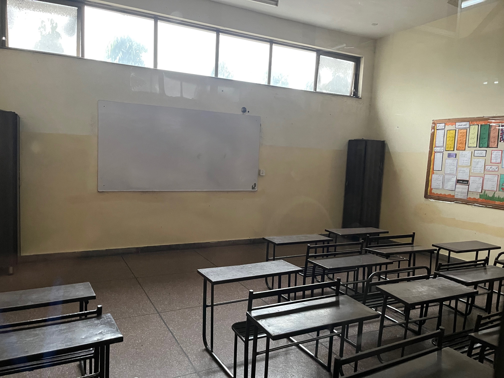

<html>
<head>
<link rel="stylesheet" href="styles.css " type="text/css">

</head>
<body>
	<article class="card">
		
		<h1>Rayan Mohammadinia</h1>
		Email: @rmohammadinia@browning.edu
	</article>

<html>
	

<h2>Classroom created by the Hope Uplift Foundation - <a href = "https://rmohammadinia.github.io/projects/hope_uplift_foundation_medical_internship.html"> HUF Medical Internship</h2>
</html>

<html>
<head>
<link rel="stylesheet" href="styles.css " type="text/css">

</head>
<body>
	<article class="card1">
<h2><a href="https://drive.google.com/file/d/1QEzVqRlK5DIJJ9U-7p6GlYoC1ZEXd2A-/view">RESUME</a></h2>
	</article>
</body>
</html>

